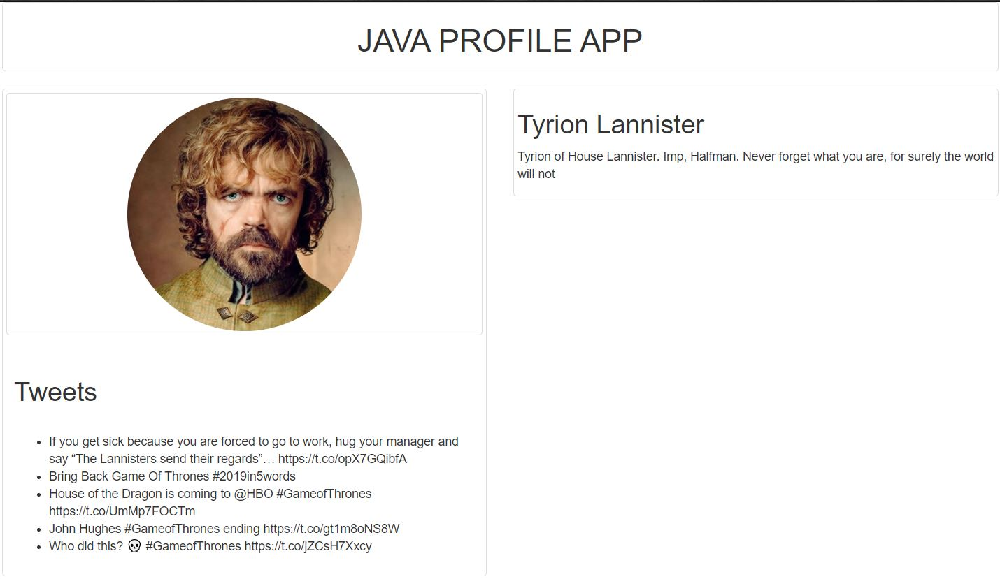
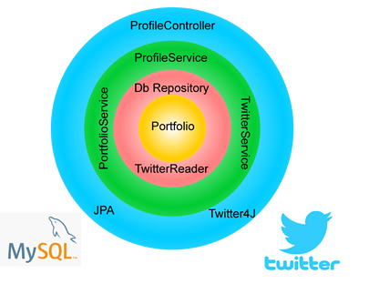
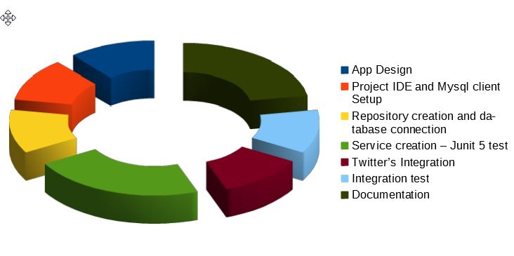
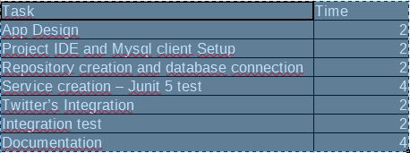

# TwitterChallenge
 Profile App keeps to show a twitter user's profile.
 
 
 
 It's developed to follow a Domain-Driven Design approach, based using techniques like TDD and best practices like SOLID principles.
 
  * How Run this App:
     - 
       You will need to first build with Maven; use the below command, please run it from the project folder which contains the pom.xml file.
       ```
       mvn package
       ```
       To run Profile app from a command line in a Terminal window you can run the java -jar command. This jar is provided where the Profile app was packaged as an executable jar file.
       ```
       java -jar target/profileApi-0.0.1-SNAPSHOT.jar
       ```       
  * Documentation and Endpoints:
     - 
 

   Now you are be able to see the Swagger documentation about REST API
       
   ```
   http://localhost:5000/swagger-ui.html#/profiles-controller
   ```
   Also you can see the profiles view, for example
       
   ```
   http://localhost:5000/view-profiles?id=2
   ```       


  Also this app is running in my personal AWS service:
  ```
  http://twitterchallenge-env.eba-me6phegv.us-east-2.elasticbeanstalk.com/view-profiles?id=4
  ```
  ```
  http://twitterchallenge-env.eba-me6phegv.us-east-2.elasticbeanstalk.com/profiles/4
  ```
 * Technologies:
    - 
     
    
  + FrontEnd
        It's a simple html view based on Jquery and  Bootstrap
        
  + BackEnd
  It's a RestFull API developed with Java 8, using SpringBoot framework, JPA-Hibernate for MySql repository.
        For the Twitter API integration Twitter4j Library and Swagger 2 for the documentation.
        
 * Time taking:
    - 
    This is an estimated taken time in hours 
     
    
    
             
